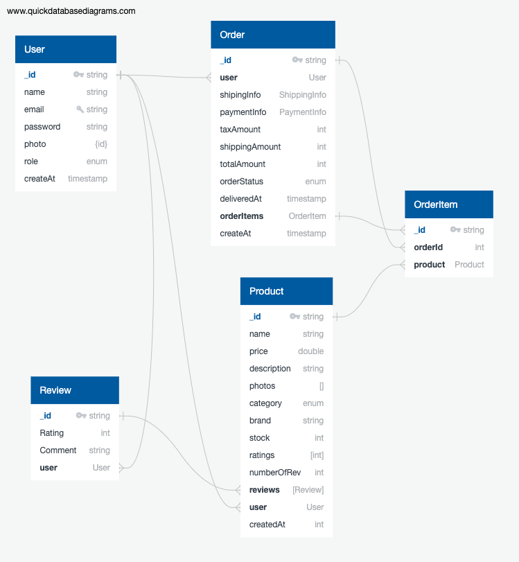

[](https://github.com/tterb/atomic-design-ui/blob/master/LICENSEs)


# TKart
 A simple, fast, and powerful APIs for the shopping a tshirt.

# Features
- Typescript based API written using Express.js, MongoDB, and Node.js
- Payment gateway using Stripe and Razorpay
- User authentication using JWT
- Docker-compose deployment
- Support multi container deployment
- Some of routes support query parameters for filtering and sorting
- Support for pagination
- Postman collection for testing
- Support for openapi specification
- Github workflow for every PR.
- Prehooks using husky for code linting, code formatting and testing
- Code coverage using istanbul
- Testing with mocha and chai

# Development
- Clone the repository from [GitHub](https://github.com/atk81/tKart)
- Install dependencies using [npm](https://www.npmjs.com/)
- Set environment variable in .env file for reference use [env](https://github.com/atk81/tKart/blob/main/.env.default).
- Run the following command to start the server
    ```bash
    npm install
    npm start dev-server
    ```

# ROUTES
## **USER**
| **METHOD** | **ROUTES** | **Summary** |
| :--- | :--- | :--- |
| POST | /api/v1/signup | Signup a new user |
| GET | /api/v1/signup/verify/:token | Verify new signup via mail |
| POST | /api/v1/login | Login user |
| GET | /api/v1/logout | Logout user |
| POST | /api/v1/forgotPassword | Forget Password will send a new reset link on mail |
| GET | /api/v1/forgotPassword/verify/:token | Reset password using token send on mail |
| POST | /api/v1/changePassword | User reset password once login |
| POST | /api/v1/user/update | Update user profile |
| POST | /api/v1/user/upgradeUserRoleRequest | Request for user upgrade for vendor or manager, Mail will send to admins who can either accept or reject |
| GET | /api/v1/userdashboard | Show info about user |
---

## **ADMIN**

| **METHODS** | **ROUTES** | **Summary** |
| --- | --- | --- |
| GET | /api/v1/admin/allusers | Get all user |
| GET | /api/v1/admin/user/:id | Get a single user by ID |
| PUT | /api/v1/admin/user/:id | Update sing user |
| DELETE | /api/v1/admin/user/:id | Delete a user |
| GET | /api/v1/admin/updateRole/:id/:token?roles=xyz&amp;approve=xyz | Approve/Reject user request for upgrade his/her roles |
| GET | /api/v1/alladmins | Get all admins |
---

## **PRODUCTS**

| **METHOD** | **ROUTES** | **SUMMARY** |
| --- | --- | --- |
| POST | /api/v1/product/add | Add a product |
| PUT | /api/v1/product/:id | Update info about the product |
| PUT | /api/v1/product/:id/deletePhotos | Delete single/multiple photos of a product |
| DELETE | /api/v1/product/:id | Delete a product |
| GET | /api/v1/product/:id | Get a single product |
| GET | /api/v1/products | Get all the products, this routes support query like limit for pagination, search and filter. |
---

## **REVIEWS**

| **METHOD** | **ROUTES** | **SUMMARY** |
| --- | --- | --- |
| GET | /api/v1/product/:id/reviews | Get all the reviews for a single products |
| POST | /api/v1/product/:id/addreview | Add a review for a product |
| DEL | /api/v1/product/:id/removereview | Remove/delete a reviews which can be removed by either admin or user but can&#39;t delete by the product owner. |
---

## **ORDER**

| **METHOD** | **ROUTES** | **SUMMARY** |
| --- | --- | --- |
| POST | /api/v1/product/:id/addtocart | Add a product into the cart, user can also able to add quantity of the product |
| GET | /api/v1/user/cart | User cart |
| POST | /api/v1/user/createOrder | Create order |
| GET | /api/v1/user/orders | Get all the orders, user can able to add pagination, search the order by passing query. |
| GET | /api/v1/user/order/:id | Get the details info about the single order |
| POST | /api/v1/user/order/:id/cancelled | Request for cancel the order |
| GET | /api/v1/admin/getOrders | Admin can get all the orders |
| GET | /api/v1/admin/getOrder/:id | Get the details info about the single order |
---

## **ADDRESS**
| **METHOD** | **ROUTES** | **SUMMARY** |
| --- | --- | --- |
| POST | /api/v1/user/addAddress | Add a address |
| PUT | /api/v1/user/updateAddress/:id | Update a single address |
| DELETE | /api/v1/user/deleteAddress/:id | Delete a single address |
---
## **PAYMENT**
| **METHOD** | **ROUTES** | **SUMMARY** |
| --- | --- | --- |
| GET | /api/v1/stripeKey | Get stripe public key |
| POST | /api/v1/captureStripePayment | Capture the details for stripe payment |
| GET | /api/v1/razorpayKey | Get razorpay public key |
| POST | /api/v1/captureRazorpayPayment | Capture the details for razorpay payment |
---

## MODEL



## TODOs
- Add openapi documentation
- Add Test for all the routes
- Update models png.

## Contributing

Contributions are always welcome!
Please adhere to this project's `code of conduct`.